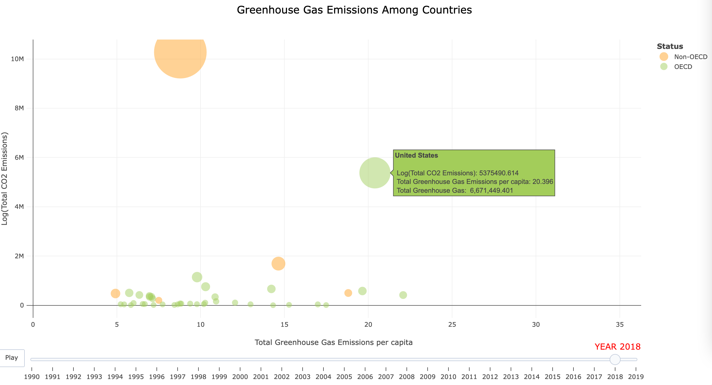

# Bubble Chart - Greenhouse Gas Emissions Over Time & OECD Status

Data Source:  Greenhouse Gas Emissions 1990 - 2019 by Country from OECD (Organisation for Economic Co-operation and Development) [download here](
https://stats.oecd.org/Index.aspx?DataSetCode=AIR_GHG).

Your writeup should include the rationale for your design choices, focusing on the interaction aspects and connecting these choices to a data abstraction (including a characterization of the raw data types and their scale/cardinality, and of any derived data that you decided to compute) and the task abstraction. You should also concisely describe your visual encoding choices.

The goal here is to explore what collaboration between different countries has been done in the past and whether such collaboration or policy has improved the greenhouse gas emission. Specifically, we are investigating whether OECD (Organisation for Economic Co-operation and Development) is a sustainable and impactful model, so we can decide whether this is the type of collaboration that should be advocated in the long run. The OECD is believed to be at the heart of international co-operation: their Member countries work with other countries, organizations and stakeholders worldwide to address the pressing policy challenges of our time.

The data was extracted from the OECD website, which was then cleaned to capture the overall greenhouse gas emission, greenhouse gas emission per capita, CO2 emission values, and year recorded of the participating countries. There is a new column added based on whether the country is a OECD member or not. It contains records of 46 countries and their emission data from 1990 to 2019.

Data Type and Description
* country: Country name
* ghg_total: Total Greenhouse gas emissions
* ghg_cap: Total Greenhouse gas emissions per capita
* co2_total: Log transformed total CO2 emissions
* year: 
* status: Whether is a OECD member or not

In order to provide a fair and unbiased visualization that is open for the audience’s understanding and interpretation, I built my bubble plot based on three dimensional variables: x-axis captures the total greenhouse gas emissions per capita, y-axis captures the log transformed of total CO2 emissions, and the size of bubble represents the actual total of greenhouse gas emissions. Also, I used neutral colors representing the OECD member status of a country, which will bring less bias to the table. 

Our vision has changed over time in a way that there are millions of ways to evaluate the effectiveness of OECD, but to make it more closely connected to the overal topic, we will be looking at very specific measures (e.g. air pollution data over time) to make our preliminary assessment. The purpose of this visualization is to investigate whether being a member country of the Organization for Economic Cooperation and Development (OECD) necessarily translates to a greener country with lower greenhouse gas emissions. Over time, more and more countries are recognizing the perks of being an OECD country where countries come together to develop best environmental practices. The OECD provides a platform to address the most urgent issue of today’s world. Most OECD countries are considered to be developed countries that have a strong and stable economy. For our current visualization, it is able to communicate the questions on whether the member countries were able to build a greener economy and whether the non-member countries significantly produced more greenhouse gas and other toxins over time.

Below is the first implementation of the bubble chart. In the coming weeks, we plan to improve an easier interpretation and find better symbols/methods to represent different countries and the time series.

 

