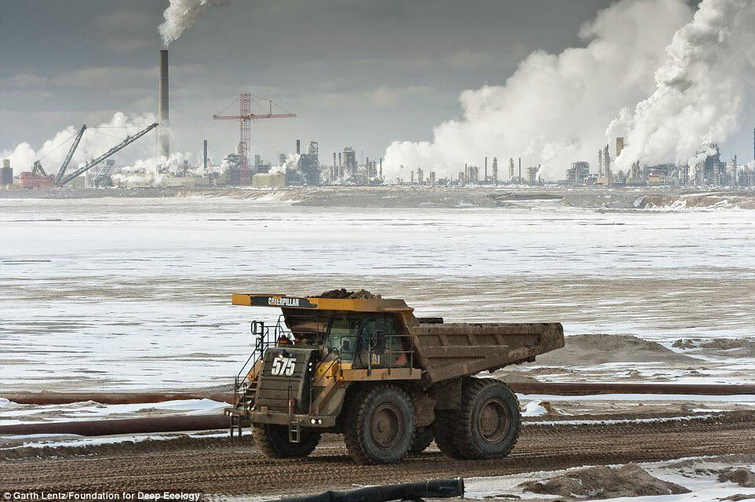

<style type="text/css">
  body{
  font-size: 13pt;
}
</style>

```{r setup, include=FALSE}
knitr::opts_chunk$set(echo = TRUE)
library(prettydoc)
library(tidyverse)
```

## Overview

Climate change is one of the hardest pressing issues that modern society faces. From the advent of transport automation via coal to increased industrial wastage, the environment that we know is slowly becoming perilous. The impact of climate change is real and is already having a significant impact on our ecosystems, economies, and our communities. This project hopes to showcase how, as global citizens, we got here coupled with understanding the causations and future ramifications of global warming.

We will explore climate change and its influence on different aspects of society. In the end, we are hoping to compare the different regions and highlight how they are affected by the ongoing effects of climate change. 

Here are a couple of preliminary questions we have in mind: Do some countries have better climate change policies than others, and is this reflected in the data? Does the type of geography or location have an effect on the amount of warming?

```{r echo=FALSE, out.width = '100%', fig.align='center'}

```

## Visualizations

### Figure 1 - Interactive World Map 
This visualization will depict temperatures across countries with color intensity indicating higher temperatures. The map is animated and features an interactive slider, allowing for the temporal component to be displayed so we can easily see changes over time.

<iframe src="Interactive_World_Map/Interactive_World_Map.html" width="950" height="950" data-external=1 style="border:none;">
</iframe>

<br />

Some unique insights gained from this graph is the ability visualize how the globe is slowly getting warmer and compare what portions of the globe are getting warmer than the others. For example, the time travelers can notice that the most prominent color is light red around 1885 and once we get to 2007 a darker red (indicating warmer climate).  We can also notice how some regions are getting warmer than others, such as the **Middle East** and **Northern Africa.**

<br />

### Figure 2 - Chord Diagram: Human Population Migration
This interactive chord diagram was made in R using the chorddiagram library. It showcases the number of humans moving from one country to the next (and vice versa) parallelly. What we wanted to notice here is how many people are migrating to and from what countries the most. We wanted to understand and begin to explore how this data will relate to the morality as well as the carbon dioxide emission rates by country. This data was taken from a 2004 dataset on global flow of people from the United Nations.

<iframe src="Chord_Diagram/Chord_Diagram.html" width="900" height="550" data-external=1 style="border:none;">
</iframe>

<br />

## Looking at the Present to better our Future

### Figure 3 - Mortalities Associated with Air Pollution

The below bubble chart depicts the countries with the highest mortality rates attributable to total air pollution as of 2016. Although the US and China are among the world's biggest carbon polluters, they have less deaths per 100,000 individuals. Nigeria and Sierra Leone seem to be the countries in which civilians are facing death at the highest rates. This could be due to lack of medical equipment, doctors, and more. This information could be used to receive future funding for medical supplies and equipment in countries that face high air pollution but do not have the facilities to treat those effected by illness. 

<br />

<iframe src="air_pollution_mortality/bubble_mortality.html" width="900" height="600" data-external=1 style="border:none;">
</iframe>

<br />


### Figure 4 - Mortality by Country

We now take a look at the mortality rates attributable to different kinds of air pollution. According to Climate Trade , the United States, China, and India are among the top carbon polluters in the world. We can visualize how the citizens of these countries are faring in the midst of this heavy air pollution in their home countries. The notable feature here is that we get a side-by-side breakdown of how each of the illnesses below effects each gender:

* COPD - chronic obstructive pulmonary disease

* IHD - ischaemic heart disease

* LRI - Lower Respiratory Infection

* Stroke

* T,B,LC - Trachea, Bronchus, Lung Cancers

<br />

#### Figure 4a - China
<iframe src="air_pollution_mortality/china_mortality_air.html" width="900" height="400" data-external=1 style="border:none;">
</iframe>

We can see that individuals in China mainly suffer from lower respiratory infections, and that stroke is the least prevelant cause of death attributable to air pollution. However, upon further examination, we see that stroke is actually the second highest cause of death attributable to air pollution among men. Thinkng future state, we can use this information to suggest creating more awareness around potentially fatal strokes in men.

<br />

#### Figure 4b - India
<iframe src="air_pollution_mortality/india_mortality_air.html" width="900" height="400" data-external=1 style="border:none;">
</iframe>

We can see that the highest cause of death among both genders in India are Trachea, Bronchus, and Lung Cancers. However upon further examination we see that women in India are suffering from lower respiratory infection at much higher rates than men. The EPA could use this information to ensure that women in countries with high carbon emissions such as India are evaluated regularly for any signs of respiratory infection as well as Trachea, Bronchus, and Lung Cancers.

<br />

#### Figure 4c - US
<iframe src="air_pollution_mortality/us_mortality_air.html" width="900" height="400" data-external=1 style="border:none;">
</iframe>

The US did not report any deaths attributable to household air pollution however again we see that stroke and Trachea, Bronchus, and Lung Cancers are the most prevalant illnesses among those affected by air pollution.


<br />


### Figure 6 - Interactive Scatter and Histogram For Various Countries

The interactive scatter and histogram plot was made in Altair via Python. The unique feel of being able to interactive with two different types of plots will serve as a cornerstone in our final portfolio project. This graph was achieved by tidying Berkeley’s climate change data from 1600 - 2000’s across various countries and dates. We were able to populate the 20 countries with the hottest and coolest climates (for the sake of a simple visualization) and allow users to interact with them via the plot. The histogram also juxtaposes different countries and shows how different the temperatures are via dynamic scaling. All of this also includes hovering over scatter points and bar graphs within the histogram. This unique plot aligned with our initial proposal, answering the question we posted on “how different countries temperature trends relate to each other.” 

<iframe src="Scatter_Histogram/Scatter_Histogram.html" width="1000" height="900" data-external=1 style="border:none;">
</iframe>

To the time travelers, this graph shows the viewers a clean and easy way to compare various countries to see how much they differ in terms of their average temperature change in Celsius. This is very useful to the audience, as it gives them a first hand interactive way to see how much countries differ in terms of their change in temperature by region.

<br />


### Figure 7 - Interactive Globe Map
The globe plot visualization displays the maximum change in temperature in the last three hundred years for over a hundred cities across the globe.
<br>

<iframe src="Globe_Temp/globeplot.html" width="900" height="900" data-external=1 style="border:none;">
</iframe>

<br />

## Looking Towards the Future 

### Figure 8 - Global Total Energy Consumption of Non-Renewable Resources Time Series Graph 

This time series graph showcases the total global energy consumption of non-renewable resources, bisected by areas of the world (Asia, etc.). This graph was made in R using the dygraphs package. The data was gathered from Kaggle and is measured in Terra Watts and Hour. Some notable design features of the graph include the ability to scroll across the years, hover and drag option, along with dynamic changing of TWh values per regions of the globe.

<iframe src="TotalEnergy/totalenergy.html" width="900" height="900" data-external=1 style="border:none;">
</iframe>

The purpose of the graph is to show the time travelers how the much energy the globe is using via oil, gas, etc. and understand what we can do next. As we can see, the graph is going up in terms of everything as the years progress and the only way to combat is using renewable energy resources.

<br />


## Conclusion

Climate change is a pressing issue that goes beyond national borders and requires global cooperation and effort to develop solutions at all levels. Our project is to showcase the effects of climate change, how humans are suffering from it, and how we can stop it (and where we’re going).

The data in this report was used to explore and visualize four main areas: climate change by temperature, sustainability by reviewing consumption and adoption of non-renewable and renewable energy resources, human impact through air pollution mortalities and population migration, and OECD collaboration to make an environmental impact on greenhouse gas emission. Notable insights we discovered are that countries with top carbon polluters experience more mortalities due to air pollution, the average temperatures of countries are slowly rising as time moves on, sustainable energy resources are slowly being replaced by non-renewable sources of energy across the globe, and how not enough policies are being passed to deal with these pressing issues. With the insights gathered, we hope to provide the readers with one simple message: we need to inform ourselves of the effects of climate change and realize that drastic transitions need to be made to combat these calamities. 

For future direction, we’re considering extending our visualizations to predictive models by applying regression-based methods to our datasets. We are also hoping to build more interactive dashboards that give the user more power to explore specific areas and facets they’re interested in.


```{r echo=FALSE, out.width = '100%', fig.align='center'}

```

