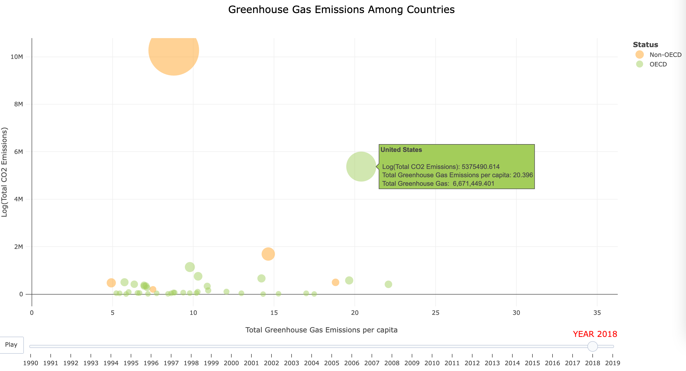
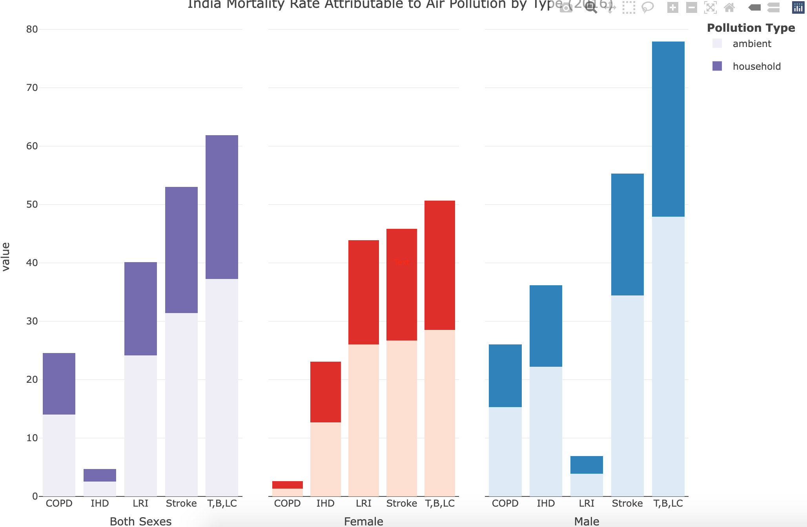
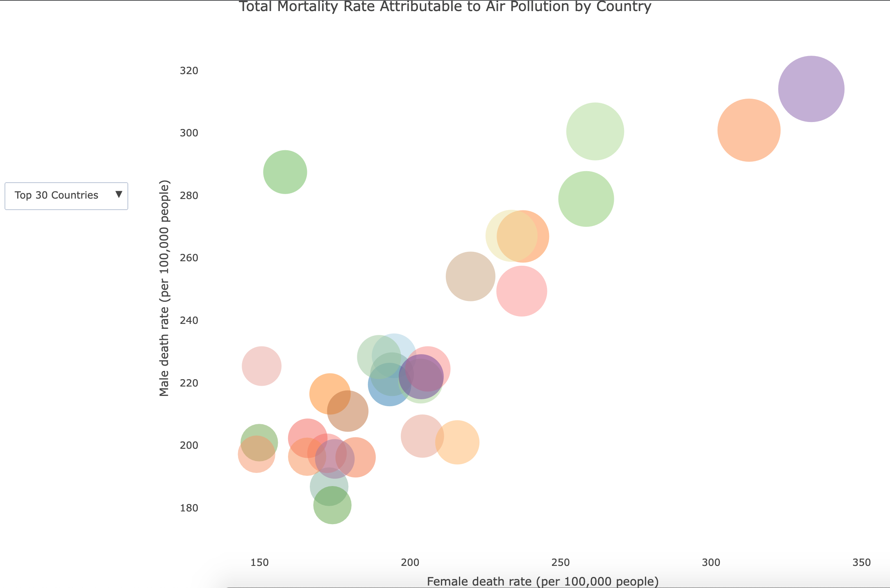
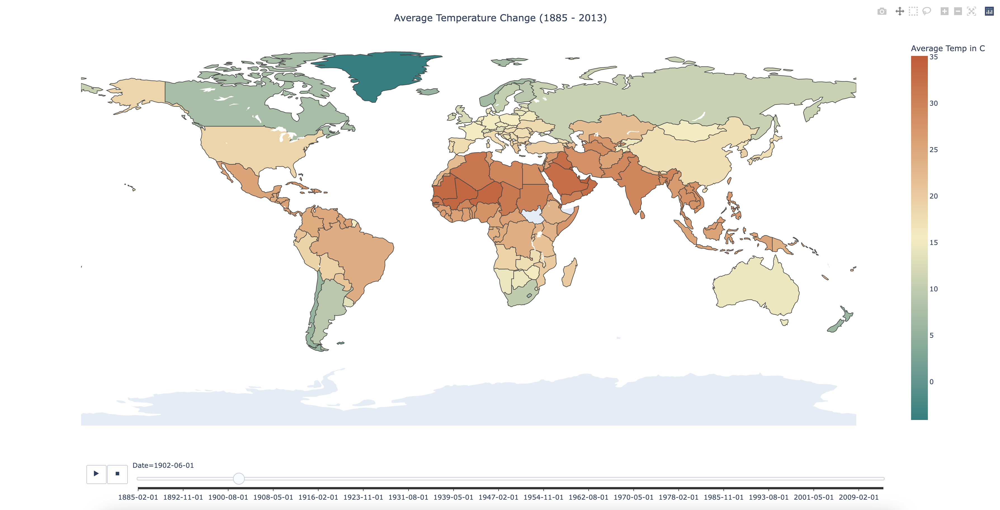
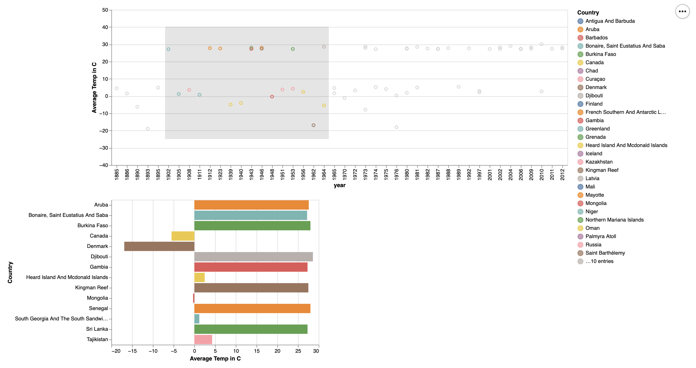
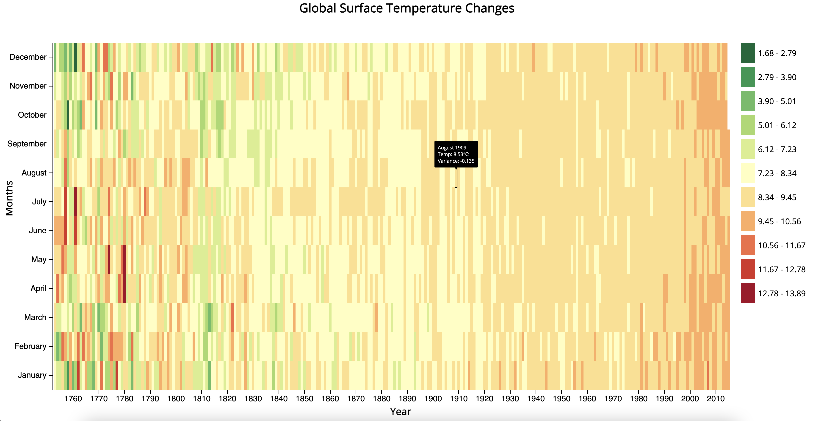
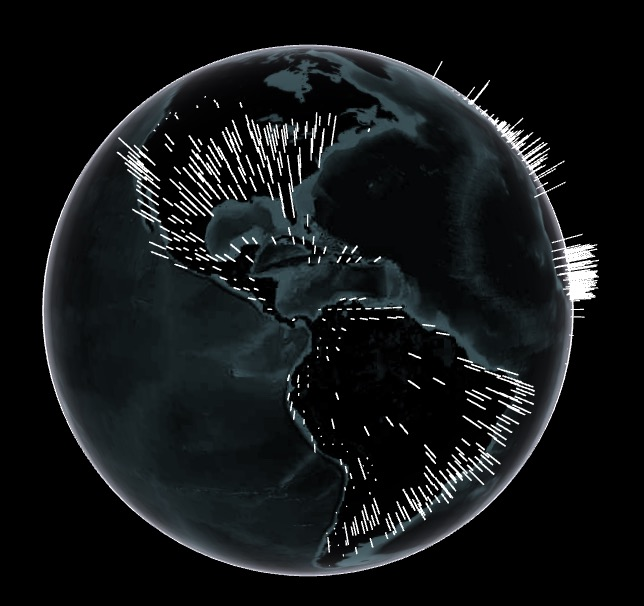

# Midpoint Writeup

Your writeup should include the following;
 The rationale for your design choices, focusing on the interaction aspects and connecting these 
choices to a data abstraction (including a characterization of the raw data types and their 
scale/cardinality, and of any derived data that you decided to compute) and the task abstraction.
 You should also concisely describe your visual encoding choices.
Talk about how your vision has changed since your proposal
How have your visualization goals changed?
Does your visualization enable the tasks you set out to facilitate or successfully communicate 
the story you want to tell?
Add at least one screenshot to your document that illustrates your current prototype. Make sure that 
all of the views you have implemented so far are documented in screenshots, you may need more than 
one.
Add a link to the original data source(s).
Briefly describe your current data preprocessing pipeline, if there is one.
NOTE: This is similar to  a "supplemental materials" document. Such documents allow authors to include 
additional details/information about the work that would not be "appropriate" for the main text (since the 
excess detail would disrupt the narrative flow). Supplemental materials documents are  common when 

## Data and Data Pre-processing

In order to assess global climate change and its impacts, this project will use datasets below:

1. Country Climate and Development Report
This dataset contains data on a given country’s current climate status and will be used to compare climate development for many different regions. The data bank provides detailed information on 330 different climate metrics from 1960 to 2021. It includes demographic variables, data-time variables, and pre-selected climate related variables (e.g. per capita daily coal assumption, population exposed to floods). In order to understand changes within different climate indicators (e.g. water consumption and water pollution) due to industry practices in different areas over time, this dataset needs to be preprocessed to include chosen countries for analysis and the missing data will need to be addressed properly as well. 

2. CO2 Emissions per capita 
This dataset contains the rate of CO2 emissions every year from 1960 to 2018 by country. It includes demographic variables (country name and its code) and CO2 emission rate of every year. In order to explore how the rates of CO2 emissions change over time by country and note which countries emit the highest amount of CO2 over time and visualize the same, this dataset needs to be preprocessed to address the missing values for certain countries and certain years.

3. Environment Statistics on Governance 
This dataset contains the years of formalization of participation in a selection of international environmental treaties and conventions for countries. It includes demographic variables, the year that the country joined the international treaties and conventions. In order to determine how the environmental policies and actions have influenced climate change, this dataset needs extensive clean-up since not all countries were invited to participate. 

## Processing pipeline:

In this project, all three datasets above will be cleaned in the preferred software tool (R or Python) chosen by the designated individual in a pre-agreed format and will be joined together later by country name. However, since dataset #3 does not include all the countries, a new column will be created on whether the country was eligible for participation in an international treaty or convention. After integrating data from all three sources, data quality will be checked to address missing values and outliers and to standardize certain variables (e.g. per capita transformation).

## Interactive World Map 
This visualization will depict temperatures across countries with color intensity indicating higher temperatures. Countries can be hovered over and selected to convey additional information about other climate indicators such as carbon emissions, and water pollution.

Notable features: Visualization will have a drop down menu allowing the user to define a selection criteria. For example, only show countries with temperatures above 70 degrees and X amount of water consumption. This could also extend to precipitation and future climate weather patterns.

## Interactive US Map
This visualization will serve as an extension of the Interactive World Map above. Color intensity will depict temperatures and states can be drilled down to convey additional information about our other climate indicators. 

Notable features: Visualization will have a drop down menu allowing the user to define a selection criteria. For example, only show states with temperatures above 70 degrees and X amount of water consumption. This could also extend to precipitation and future climate weather patterns.

## Interactive Globe Map
This visualization will be a rotating globe that will portray future predictions/projections on precipitation and temperature. The user will be able to select a range of temperature and precipitation increase to see how the world will heat up due to these changes.  The notable feature of this graph is that it is a novel visualization that uses predictive methods to showcase how climate zones will change in response to global temperature increase. 

## Bubble Chart - Greenhouse Gas Emissions Over Time & OECD Status

Data Source:  Greenhouse Gas Emissions 1990 - 2019 by Country from OECD (Organisation for Economic Co-operation and Development) [download here](
https://stats.oecd.org/Index.aspx?DataSetCode=AIR_GHG).

Your writeup should include the rationale for your design choices, focusing on the interaction aspects and connecting these choices to a data abstraction (including a characterization of the raw data types and their scale/cardinality, and of any derived data that you decided to compute) and the task abstraction. You should also concisely describe your visual encoding choices.

The goal here is to explore what collaboration between different countries has been done in the past and whether such collaboration or policy has improved the greenhouse gas emission. Specifically, we are investigating whether OECD (Organisation for Economic Co-operation and Development) is a sustainable and impactful model, so we can decide whether this is the type of collaboration that should be advocated in the long run. The OECD is believed to be at the heart of international co-operation: their Member countries work with other countries, organizations and stakeholders worldwide to address the pressing policy challenges of our time.

The data was extracted from the OECD website, which was then cleaned to capture the overall greenhouse gas emission, greenhouse gas emission per capita, CO2 emission values, and year recorded of the participating countries. There is a new column added based on whether the country is a OECD member or not. It contains records of 46 countries and their emission data from 1990 to 2019.

Data Type and Description
* country: Country name
* ghg_total: Total Greenhouse gas emissions
* ghg_cap: Total Greenhouse gas emissions per capita
* co2_total: Log transformed total CO2 emissions
* year: 
* status: Whether is a OECD member or not

In order to provide a fair and unbiased visualization that is open for the audience’s understanding and interpretation, I built my bubble plot based on three dimensional variables: x-axis captures the total greenhouse gas emissions per capita, y-axis captures the log transformed of total CO2 emissions, and the size of bubble represents the actual total of greenhouse gas emissions. Also, I used neutral colors representing the OECD member status of a country, which will bring less bias to the table. 

Our vision has changed over time in a way that there are millions of ways to evaluate the effectiveness of OECD, but to make it more closely connected to the overal topic, we will be looking at very specific measures (e.g. air pollution data over time) to make our preliminary assessment. The purpose of this visualization is to investigate whether being a member country of the Organization for Economic Cooperation and Development (OECD) necessarily translates to a greener country with lower greenhouse gas emissions. Over time, more and more countries are recognizing the perks of being an OECD country where countries come together to develop best environmental practices. The OECD provides a platform to address the most urgent issue of today’s world. Most OECD countries are considered to be developed countries that have a strong and stable economy. For our current visualization, it is able to communicate the questions on whether the member countries were able to build a greener economy and whether the non-member countries significantly produced more greenhouse gas and other toxins over time.

Below is the first implementation of the bubble chart. In the coming weeks, we plan to improve an easier interpretation and find better symbols/methods to represent different countries and the time series.

 

## Bar Chart - Analyzing mortality causes by Sex and Country 

### Data Sources: 
Datasets: World Health Organization (WHO) 
(https://www.who.int/data/gho/data/indicators/indicator-details/GHO/ambient-and-household-air-pollution-attributable-death-rate-(per-100-000-population-age-standardized).

   1. Ambient and Household Air pollution attributable death rate (per 100,000 people) - age standardized
   2. Ambient Air pollution attributable death rate (per 100,000 people) - age standardized
       Ambient air pollution only 

### Design Choices
For this data, we are representing the various illnesses that can cause death and are attributable to air pollution. Because we want to compare the distributions of the various illnesses and how they effect both sexes, a side by side bar chart seemed appropriate. For this dataset, we are only given death attributable to "ambient and household" air pollution and just "ambient" (also known as "outdoor") air pollution. A column had to be created in which we calculated deaths attributed to just household air pollution so that a comparison can be made. The "ambient and household" (which serves as a total) data was then removed to avoid plotting duplicate information. Lastly, only 3 countries were selected - China, India and the US. This is because these are the world's top carbon polluters and thus it raises a question on how the citizens of these countries are faring in the midst of this heavy air pollution.

This bar chart contains a lot of information such as the pollution types as indicated by the opacity of the bar segments so that a viewer may easily distinguish between whether ambient or household air pollution causes more deaths. Additionally, the entire plot is a subplot of 3 bar charts merged together - one containing a plot for all deaths (both sexes), one for only female deaths, and one for only male deaths. Male deaths are color coded as blue, female deaths are color coded as red, and both are color coded as purple. These colors are commonly used when making comparisons based on sex. The goal of making comparisons based on sex was added when performing general EDA on this dataset. For instance, in China, men are dying due to stroke at a significantly higher rate than women are in China. However in India, women are dying of Lower Respiratory Infection at much higher rates than men. Thus, in order to capture the full picture sex was included. 

Below is the first implementation of this bar chart. In the coming weeks we plan to edit the colors in the hover tools to promote easier readability as well as changing the legend color to just black instead of purple. 

 

## Bubble Chart - Analyzing Countries with the Highest Mortality

### Design Choices
For this visualization, we are taking a step back and assessing which countries actually have the highest rates of mortality due to air pollution. Similar to the bar charts above, we are again assessing deaths and using sex as a point of comparison. A scatter plot was a good choice for this since we can identify clusters or outliers easily and see whether any relationships exist between male and female deaths, across various countries. Because there are hundreds of countries in the dataset, we decided to take smaller segments. We took the top 30, top 50, and top 100 countries with the highest mortality rate attributable too *all* air pollution. A dropdown menu was used so that the viewer may easily toggle between the top countries. Again, because there are still many countries being compared, no color scale was used and instead, seperate colors were assigned to each individual country. The size of each bubble, or country, is dictated by the *total* mortality attributable to air pollution. Whereas the x and y axes represent female and male mortaliy rates, respectively. 

The goal of representing all countries changed to only a select few because it is difficult to depict hundreds of countries at once and could lead to burdening the viewer with deciphering what the visualization actually means. This is where the idea for the dropdown menu came from. Below is the first implementation of this bubble chart. 

 

## World Temperature Slider

### Design Choices
This graph, designed in plotly via Python, depicts the overall temperatures of countries across the world. The uniqueness of this graph comes from the slider underneath, which allows the users to slide across the various years from 1885 - 2013. This graph is also animated, as once you open index.html it'll automatically allow the transition between the years to happen. Another interesting design perspective chosen here, is the color scheme. We chose a very unique color scheme of red-pallets which will allow the readers to immediately identify which countries are hot, moderate, or cold in a given year. We felt that this color scheme best impacts the map, giving it a fresh and vibrant feel (as compared to the ones that are readily available online).

[World Temperature Slider - Data Source](https://www.kaggle.com/datasets/berkeleyearth/climate-change-earth-surface-temperature-data
)

## Interactive Scatter/Histogram 

### Design Choices
The interactive scatter plot and histogram serves as the main crux for understanding this project. The basic design principle of the intertwined graph is the ability to select various points on the scatter plot, which represent the countries across the years along with the average temperature, and seeing the changes being done to the histogram. The changes on the histogram will directly correlate to what points are being chosen and will give the viewers a first hand feel and experience to compare how the different countries compare to each other instead of just a table (or a line graph per se).

This view focuses on interaction via data abstraction on the plot and derives a new data frame which the users can utilize. The scales are dynamically changing along with the colors chosen via the country. This graph will ultimately combine with the 3D world mock up to give a new and refreshing user experienced focus data visualization for our final project.

[Interactive Scatter/Histogram  - Data Source](https://www.kaggle.com/datasets/berkeleyearth/climate-change-earth-surface-temperature-data
)
 
## Heat Map

### Design Choices
The interactive heat map was achieved via the visualization tools within JavaScript and D3. The main focus of this was to get a unique perspective on understanding how the global temperatures varies across the years in color. The unique color schemes gives the audience an underlying feel of being cognizant of what times of the year the temperatures are the highest and lowest globally. The unique design choice here was just the ethos of a plain and simple graph coupled with hover of the date (month,year), temperature, and the variance of the temperature. However simple it may be and coupled with the world temperature by country slider graph, gives the reader a true understanding of how the Earth is getting warmer.

[Heat Map  - Data Source](https://github.com/freeCodeCamp/ProjectReferenceData)

## Globe Visualization

### Design Choices
The globe plot visualization displays the maximum change in temperature in the last three hundred years for over a hundred cities across the globe. The plot was built using threejs, and allows the end-user to swivel, zoom, and pan across the globe at will to investigate the change in temperature by city. The three-dimensional nature of the globe allows the end-user to see the impacts of climate change at the scale they’re most interested in. The globejs function from threejs allows easy, repeatable three-dimensional plotting of any value given that a dataset contains a accompanying latitude, longitude, and value object for the plot they wish to create. 

[Globe Visualization  - Data Source](https://www.kaggle.com/datasets/berkeleyearth/climate-change-earth-surface-temperature-data)

